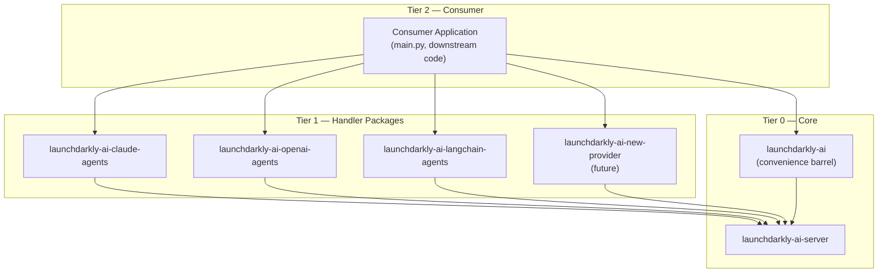

# LaunchDarkly AI SDK — Agent Guide (Python)

This document describes the architecture of the LaunchDarkly AI Python SDK and defines the contracts that all packages must satisfy. It is intended as a reference for AI agents and contributors adding new functionality, particularly new handler packages.

---

---

## Code Quality: Linting, Formatting, and Common Pitfalls

This repo uses **Ruff** for formatting + linting and **mypy** for static type checking. Always run `make lint-fix` before committing to auto-fix issues, and `make lint` + `make format-check` to verify in CI mode. Pre-commit hooks run Ruff automatically on staged files.

### Ruff Pitfalls

#### `ruff check --fix` (and pre-commit) silently removes unused imports

Unlike Flake8, which only warns, `ruff check --fix` **deletes** unused imports without prompting. If you see an `ImportError` or `NameError` after a commit, check whether a used import was removed.

Run `ruff check .` (without `--fix`) first to inspect what would be changed before auto-fixing.

#### Pre-commit modifies staged files — you must re-stage and re-commit

`.pre-commit-config.yaml` runs `ruff --fix` and `ruff-format` as a pre-commit hook. When the hook modifies files, the commit is **aborted** and you must stage the modified files and commit again:

```bash
git add -u
git commit -m "your message"
```

If you're hitting this in a loop, run `make lint-fix` and verify the output is clean before committing.

#### Use `X | None` instead of `Optional[X]` for new type annotations

The `UP007` rule (pyupgrade) converts `Optional[X]` → `X | None`. Write new code using the union syntax directly to avoid the churn:

```python
# ❌ Ruff will rewrite this
from typing import Optional
def foo(x: Optional[str]) -> Optional[int]: ...

# ✅ Write this instead
def foo(x: str | None) -> int | None: ...
```

#### Comprehension-style rules rewrite common patterns

The `C4` (flake8-comprehensions) rules enforce idiomatic Python. Ruff will auto-fix these:

```python
# ❌ Will be rewritten
list(x for x in items)         # → [x for x in items]
dict((k, v) for k, v in pairs) # → {k: v for k, v in pairs}
set(x for x in items)          # → {x for x in items}
```

Write new code in the idiomatic form directly.

#### mypy `strict = true` — all functions must be fully annotated

The mypy config uses `strict = true`, which enforces:
- No implicit `Any` — every parameter and return type must be explicit.
- No untyped function definitions — all `def` and `async def` need annotations.
- No untyped imports — if a third-party library has no stubs, use `# type: ignore[import-untyped]`.

When adding new functions or methods, always include full type annotations. Run `make typecheck` to verify before pushing.

#### `Generic[T]` syntax is intentionally kept (UP046 is ignored)

The `UP046` rule (PEP 695 `type` statement syntax for generic classes) is **ignored** in `pyproject.toml`. Do not convert `class Foo(Generic[T]):` to PEP 695 syntax — it is a deliberate migration decision.


## Package Hierarchy

The monorepo is organized into three tiers plus a convenience barrel. Dependencies only flow **downward** — never sideways between packages in the same tier, and never upward.



### Tiers

- **Tier 0 — Core** (`launchdarkly-ai-server`): The foundation. Owns all LaunchDarkly integration, telemetry orchestration, shared data types, and the primary entry points (`config()`, `graph()`, `resolve_graph()`). Has no dependency on any other `launchdarkly-ai-*` package.
- **Tier 0 — Convenience barrel** (`launchdarkly-ai`): A pure re-export package that makes all of `launchdarkly-ai-server` available under a shorter install name. No new logic — intended as the default install for most Python applications.
- **Tier 1 — Handler packages** (`launchdarkly-ai-claude-agents`, `launchdarkly-ai-claude-messages`, `launchdarkly-ai-openai-agents`, `launchdarkly-ai-openai-messages`, `launchdarkly-ai-langchain-agents`, `launchdarkly-ai-langchain-messages`, …): Each wraps a specific AI provider SDK. Depends on `launchdarkly-ai-server` for shared types and utilities. Must not depend on other Tier 1 packages.
- **Tier 2 — Consumer applications** (e.g. `main.py`, downstream projects): Imports from one or more handler packages and either `launchdarkly-ai` or `launchdarkly-ai-server`. Owns tool implementations and orchestration logic. No `launchdarkly-ai-*` package should ever depend on Tier 2 code.

### Rules

- All shared data types and utilities belong in `launchdarkly_ai_server`. Handler packages must not re-export or duplicate them.
- A new handler package needs to import `create_handler`, `AiConfigRep`, `parse_template`, and optionally `config` from the client. `ProviderHandler` is used as the return type annotation; `create_handler` is always used to produce the actual value.

---

## Client Package (`launchdarkly-ai-server`)

### Lifecycle

The client manages a singleton connection to LaunchDarkly and the associated telemetry pipeline.

| Export | Description |
|---|---|
| `init_client(options?)` | Auto-discovers and initializes `launchdarkly-server-sdk` (optional dep, loaded via `importlib`). Optional — the first AI API call triggers lazy init when `LD_SDK_KEY` is set. Accepts optional overrides for SDK key, base URIs, service name, environment, and OTLP endpoint. Returns `Awaitable[LDClientInterface]`. |
| `init_client(client=...)` | **BYOC overload** — accepts a pre-initialized `LDClientInterface`. Stores it directly without calling the SDK. |
| `get_client()` | Returns the initialized `LDClientInterface`. Throws if initialization has not completed. |
| `shutdown()` | Flushes all pending events and telemetry, then closes the client. Must be awaited before the process exits. |

### Core Data Types

These types are the shared contract between the client and all handler packages. Handler packages import them from `launchdarkly_ai_server`, never redefine them.

#### `LDContext`

A plain Python `dict` (or any mapping) with the standard LaunchDarkly context fields. All current LaunchDarkly SDK versions accept this structure.

```python
# Single-kind context
context = {"kind": "user", "key": "user-123", "email": "ada@example.com"}

# Multi-kind context
context = {
    "kind": "multi",
    "user": {"key": "user-123"},
    "org": {"key": "org-456"},
}
```

#### `AiConfigRep`

The AI configuration object fetched from a LaunchDarkly flag variation. Represents everything a handler needs to make a provider call.

| Field | Type | Required | Description |
|---|---|---|---|
| `model` | `{"name": str, "region"?: str, "parameters"?: dict, "custom"?: dict}` | yes | Provider model to invoke. |
| `provider` | `{"name": str}` | yes | Identifies the AI provider (e.g. `"Anthropic"`, `"OpenAI"`). Used for handler routing. |
| `instructions` | `str` | one of | System prompt, may contain `{{variable}}` template placeholders. LD context attributes are also available as `{{ldContext.key}}`, `{{ldContext.email}}`, etc. |
| `messages` | `list[{"role": str, "content": str}]` | one of | Conversation history. Roles: `user`, `assistant`, `system`. Content may use the same `{{variable}}` and `{{ldContext.xxx}}` placeholders. |
| `tools` | `dict[str, Tool]` | no | Named tool definitions available to the model. |
| `judgeConfiguration` | `{"judges": list[{"key": str, "samplingRate": float}]}` | no | Controls automatic evaluation judges. |
| `evaluationMetricKey` | `str` | no | LaunchDarkly metric key for tracking evaluation scores. |
| `outputFormat` | `dict` | no | Optional JSON Schema the model output must conform to. Handlers enforce structured output via the provider's native API where supported, or via system-prompt injection as a fallback. Ignored in streaming mode. |

At least one of `instructions` or a non-empty `messages` list must be present.

#### `Tool`

A tool definition that can be registered with a provider.

| Field | Type | Description |
|---|---|---|
| `name` | `str` | Unique tool name. |
| `type` | `"function"` | Always `"function"`. |
| `parameters` | `dict` | JSON Schema describing the tool's input parameters. |
| `description` | `str?` | Human-readable description passed to the model. |
| `customParameters` | `dict?` | Provider-specific extra configuration. |

#### `VariationMeta`

LaunchDarkly metadata attached to a flag variation.

| Field | Type | Description |
|---|---|---|
| `enabled` | `bool?` | Whether this variation is active. |
| `variationKey` | `str?` | Identifier for the specific variation. |
| `version` | `int?` | Variation version number. |
| `mode` | `"agent" \| "completion" \| "judge"` | Execution mode, used alongside `provider.name` to select a handler. |

#### `ProviderResponse`

The value returned to callers of `config().invoke()`. A `dataclass` with the following fields:

| Field | Type | Description |
|---|---|---|
| `response` | `str` | The final text output from the model. |
| `usage` | `UsageDict` | Normalized token counts (`input`, `output`, `total`). |
| `track_data` | `TrackData` | Tracking payload from this invocation (run ID, config key, etc.). Carried inside each `JudgeTask` so background judge results are attributed to the originating request. |
| `judge_results` | `dict[str, JudgeResult]?` | Results from inline judge evaluations. Present when `skip_judges=False` (default) and judges ran. |
| `judge_tasks` | `list[JudgeTask]?` | Pre-packaged judge tasks. Present (as a list) when `skip_judges=True`. Each task is a serialisable dataclass ready to pass to a background thread running `run_judge(task, handlers)`. `None` when `skip_judges=False`. |

#### `ProviderGraphResponse`

The value returned by `graph().invoke()`. A dataclass with attribute access.

| Field | Type | Description |
|---|---|---|
| `response` | `str` | The final text output (from the last node executed). |
| `usage` | `UsageDict` | Aggregate token counts across all nodes. |
| `judge_results` | `dict[str, JudgeResult]?` | Results from a graph-level judge, if configured. |

#### `ConfigArgs`

Arguments accepted by `config()`.

| Field | Type | Description |
|---|---|---|
| `key` | `str` | LaunchDarkly flag key for the AI config. |
| `handler` | `ProviderHandler \| list[ProviderHandler]`? | One handler or an ordered list of handlers. Routing selects the match by provider + mode. |
| `tool_handlers` | `dict[str, Callable \| NativeTool]?` | Map of tool name → implementation function (or `NativeTool` sentinel). |
| `registry` | `Registry?` | Registry to source handlers and tools from. Local `handler`/`tool_handlers` take precedence. |
| `skip_judges` | `bool`? | When `True`, `invoke()` does not run judges inline. Instead it returns `judge_tasks: list[JudgeTask]` — pre-packaged tasks ready for background thread execution via `run_judge(task, handlers)`. Default: `False`. |

#### `TrackData`

Payload attached to every LaunchDarkly tracking event.

| Field | Type | Description |
|---|---|---|
| `runId` | `str` | Unique ID for this invocation. |
| `configKey` | `str` | The flag key that produced the config. |
| `variationKey` | `str` | The specific variation key. |
| `version` | `int` | Variation version number. |
| `modelName` | `str` | Model name from the config. |
| `providerName` | `str` | Provider name from the config. |
| `graphKey` | `str?` | Present when the event was produced inside an agent graph. |
| `toolKey` | `str?` | Present when the event is for a tool call. |
| `judgeConfigKey` | `str?` | Present when the event is from a judge execution. |

#### `NativeTool`

A marker class for provider built-in tools. Place an instance as a value in `tool_handlers` to signal that the named tool is a native provider capability rather than a user-supplied function.

```python
NativeTool(tool_name: str)
```

- `tool_name` — the exact tool name the provider SDK uses (e.g. `'WebSearch'`, `'Bash'`). A unique identity sentinel (`id`) is generated automatically on construction.

The handler package wires it to the provider SDK's built-in implementation and emits `$ld:ai:tool_call` tracking when the model invokes it.

#### `ProviderHandler`

The callable data type that handler packages produce. Use `create_handler(provides_for, fn)` to construct one — it attaches `provides_for` and returns the function as a typed `ProviderHandler`. See [Handler Package Contract](#handler-package-contract) for full details.

---

### Agent Graph Types

The graph system resolves a multi-agent topology from a LaunchDarkly flag and provides primitives to execute or walk it.

#### `GraphTopology`

The structure delivered by a graph flag variation.

| Field | Type | Description |
|---|---|---|
| `root` | `str` | Config key of the root node. |
| `edges` | `dict[str, list[{"key": str, "handoff"?: dict}]]` | Adjacency list: source config key → outgoing edges. |

#### `GraphNode`

A node in a resolved agent graph: an evaluated agent config plus its outgoing edges.

| Field | Type | Description |
|---|---|---|
| `key` | `str` | The node's config key. |
| `config` | `AiConfigRep` | Evaluated agent config for this node. |
| `meta` | `VariationMeta` | Variation metadata for this node. |
| `edges` | `list[GraphEdge]` | Outgoing edges from this node. |
| `is_terminal` | `bool` | `True` when the node has no outgoing edges. |

#### `GraphEdge`

A directed edge between two agent configs.

| Field | Type | Description |
|---|---|---|
| `key` | `str` | Stable edge identifier (`{source_key}-{target_key}`). |
| `source_key` | `str` | Source node config key. |
| `target_key` | `str` | Target node config key. |
| `handoff` | `dict?` | Optional handoff data from the graph definition. |

#### `GraphDefinition`

A resolved agent graph returned by `resolve_graph()`. A class with attribute access exposing topology accessors and execution primitives.

| Attribute | Description |
|---|---|
| `key` | The graph flag key. |
| `enabled` | Whether the graph is active. |
| `root` | The root `GraphNode`, or `None` if disabled. |
| `get_node(key)` | Returns a node by config key. |
| `get_child_nodes(key)` | Returns all outgoing neighbor nodes. |
| `get_parent_nodes(key)` | Returns all incoming neighbor nodes. |
| `terminal_nodes()` | Returns all leaf nodes (no outgoing edges). |
| `edges_from(key)` | Returns outgoing edges from a node. |
| `is_terminal(key)` | Returns `True` when the node has no outgoing edges. |
| `run_node(node, input?, opts?)` | Executes a single node through the tracked `config().invoke()` path. |
| `route(node, input?, opts?)` | Executes a node, presenting outgoing edges as handoff choices; returns the response plus the chosen `next` node. |
| `traverse(fn, ctx?)` | Awaits each visitor in BFS order (root → leaves). Visitor may be sync or async. |
| `reverse_traverse(fn, ctx?)` | Awaits each visitor in reverse BFS order (leaves → root). Visitor may be sync or async. |

#### `GraphOptions`

Options for `graph()` and `resolve_graph()`. Context is passed per-call to `resolve_graph`, and per-call to `graph().invoke()`.

| Field | Type | Description |
|---|---|---|
| `handlers` | `list[ProviderHandler]?` | Candidate handlers for node execution. Required when using `run_node`; may be omitted for framework-native runners. |
| `tool_handlers` | `dict[str, Callable \| NativeTool]?` | Global tool handlers shared across all nodes. |
| `graph_judge` | `str?` | Config key for a graph-level judge evaluated against the final output. |
| `registry` | `Registry?` | Registry to source handlers and tools from. Local values take precedence. |

---

### `config(**args)`

The primary entry point for AI config invocations. Accepts either a single handler or a list of handlers and routes to the correct one based on the flag variation's provider and mode. Context is supplied per call so the same instance can serve different users.

| Argument | Description |
|---|---|
| `key` | LaunchDarkly flag key for the AI config. |
| `handler` | One `ProviderHandler` or a list of `ProviderHandler` values (each with `provides_for` set). Optional when using a `registry`. |
| `tool_handlers` | Optional dict of tool name → implementation (or `NativeTool`). |
| `registry` | Optional `Registry` to source handlers and tools from. Local `handler`/`tool_handlers` take precedence. |

Returns a `ConfigInstance` with:
```
.invoke(user_input: str | None, context: LDContext, variables: dict | None = None, history: list[dict[str, Any]] | None = None) -> Awaitable[ProviderResponse]
.stream(user_input: str | None, context: LDContext, variables: dict | None = None, history: list[dict[str, Any]] | None = None) -> AsyncGenerator[StreamEvent]
```

**Behavior when `.invoke()` is called:**

1. Fetches and validates the `AiConfigRep` variation from LaunchDarkly using `key` and the supplied `context`. Raises if the variation is disabled or invalid.
2. Selects the handler by matching on `[config.provider.name, normalized mode]`. Selection priority: (a) exact provider match, (b) wildcard `['*', mode]` fallback for multi-provider adapters (e.g. LangChain). Raises if no matching handler is found.
3. Invokes the selected handler with the config, user input, tool handlers, variables, and history. The `context` passed to `.invoke()` is automatically merged into `variables` under the key `ldContext`, so templates can reference `{{ldContext.key}}`, `{{ldContext.email}}`, etc. If `history` is provided, it is passed to the handler as the 5th positional argument — messages-mode handlers splice it into the messages array; agent-mode handlers append it to the system prompt.
4. Emits LaunchDarkly telemetry events: duration (`$ld:ai:duration:total`), outcome (`$ld:ai:generation:success` / `$ld:ai:generation:error`), and token counts (`$ld:ai:tokens:*`).
5. If `judgeConfiguration` is present:
   - **Default (`skip_judges=False`):** runs each configured judge inline at its `samplingRate`. Results are returned in `ProviderResponse.judge_results`.
   - **`skip_judges=True`:** builds serialisable `JudgeTask` objects for each judge (no AI calls). Returns them in `ProviderResponse.judge_tasks`. Pass each task to a background thread running `run_judge(task, handlers)`.
6. Returns a `ProviderResponse` (always includes `response`, `usage`, and `track_data`).

### `graph(key, **options)`

Creates an agent graph caller bound to a graph flag key. Uses a model-driven router: starts at the root node and lets the model choose which outgoing edge to follow at each step. Stops when the model produces a terminal answer, a leaf is reached, a node is revisited (cycle guard), or the step cap is hit.

Returns a `GraphInstance` with `.invoke(input, context, variables?)`.

Requires `handlers` (either in `options` or via `options.registry`) to be set.

### `resolve_graph(key, *, context, **options)`

Resolves an agent graph's topology and node configs without executing it. The returned `GraphDefinition` carries `enabled`; callers should branch on it before traversing.

This is the entry point that framework-native runners (`to_claude_agents`, `to_openai_agents`, `to_lang_graph`) use to build their own execution structure.

### `Registry` / `global_registry` / `compose`

A `Registry` collects handlers and tool handlers that can be shared across multiple `config()`, `graph()`, and `resolve_graph()` calls.

```python
from launchdarkly_ai_server import Registry

registry = Registry(
    handlers=[create_claude_agents_handler()],
    tools={"my_tool": my_tool_fn},
)
```

`.register(handlers=[], tools={})` can be called multiple times to add more handlers or tools. Duplicate `provides_for` keys or tool names produce a warning and the last registration wins.

`global_registry` is a pre-constructed singleton `Registry` instance.

Pass a registry as `registry=...` to any of the top-level APIs. Local `handler`/`tool_handlers` take precedence over registry values.

To combine two registries, use `compose(a, b)`. It returns a new `Registry` whose contents are the union of both, with `b` taking precedence over `a` on any conflict. Neither input is mutated.

```python
from launchdarkly_ai_server import compose, global_registry

combined = compose(global_registry, local_registry)
```

### Utility Helpers

| Export | Description |
|---|---|
| `create_handler(provides_for, handler)` | Attaches `provides_for` metadata to a handler function and returns it as a `ProviderHandler`. This is the canonical way to build any handler. See [Factory Function](#factory-function). |
| `parse_template(template, variables)` | Replaces `{{variable}}` placeholders in a string. Supports dot-notation for nested values (e.g. `{{user.name}}`). Unrecognized placeholders are left as-is. |
| `parse_json_with_possible_fences(text)` | Parses a JSON string that may be wrapped in markdown code fences (` ```json ` or ` ``` `). Returns `None` if the text is not valid JSON. |

---

## Handler Package Contract

A handler package bridges a specific AI provider SDK to the `launchdarkly_ai_server` runtime. This section defines everything a new handler package must implement.

### The Handler Type (`ProviderHandler`)

A handler is a **callable that also carries metadata**. It must be both invokable as a coroutine function and have a `provides_for` attribute attached to it.

**Call signature:**

```python
async def handler(
    config: AiConfigRep,
    user_input: str | None = None,
    tool_handlers: dict[str, Callable | NativeTool] | None = None,
    variables: dict[str, Any] | None = None,
    history: list[dict[str, Any]] | None = None,
) -> dict:  # {"output": str | None, "usage": dict}
    ...
```

**Metadata attribute:**

```python
handler.provides_for = [provider_name: str, mode: Literal["agent", "messages"]]
```

The `provides_for` list is how `config()` routes to the correct handler at runtime. The mode element must exactly match the normalized `meta.mode`. The provider element must either exactly match `config.provider.name` **or** be the wildcard `'*'`. A wildcard handler is chosen only when no handler with an exact provider name matches — it acts as a fallback for multi-provider adapters like LangChain. **Always attach `provides_for` using `create_handler` rather than direct attribute assignment.**

### Factory Function

Each handler package must export a **factory function** that:

- Accepts optional configuration for the provider SDK client (e.g. API keys, base URLs).
- Initializes any provider-specific resources.
- Returns the handler callable with `provides_for` attached via `create_handler`.

The naming convention is `create_<provider>_handler()`. For example: `create_claude_agents_handler()`, `create_openai_agent_handler()`.

**Always use `create_handler` to build and return the handler.**

```python
from launchdarkly_ai_server import create_handler, parse_template
from launchdarkly_ai_server import ProviderHandler

def create_my_provider_handler() -> ProviderHandler:
    async def _call(config, user_input="", tool_handlers=None, variables=None, history=None):
        system_prompt = parse_template(config.get("instructions", ""), variables or {})
        # ... call your provider SDK ...
        return {"output": "...", "usage": {"input_tokens": 10, "output_tokens": 20}}

    return create_handler(["MyProvider", "messages"], _call)
```

`create_handler` is also the recommended pattern for **user-supplied custom handlers** at the application layer.

### Prompt Construction

The handler is responsible for translating `AiConfigRep` fields into the prompt format the provider expects:

- If `config["instructions"]` is present, treat it as the system prompt. Run it through `parse_template(config["instructions"], variables)` before sending.
- If `config["messages"]` is present, separate by role: `system`-role messages form the system prompt; `user` and `assistant` messages form the conversation history. Apply `parse_template` to each message's content.
- `user_input` is always appended as the final user turn.

> **`ldContext` is always present in `variables`.** The client automatically injects the caller's LD context as `ldContext` before invoking the handler, so `{{ldContext.key}}`, `{{ldContext.email}}`, and any other context attribute are available in every template. Handlers must not overwrite or strip `ldContext` from the variables they pass to `parse_template`.

### Tool Handling

If `config["tools"]` is present, the handler must:

1. Convert each `Tool` definition into the format the provider SDK accepts, using the tool's `name`, `description`, and `parameters` (JSON Schema).
2. When the provider requests a tool call, look up the tool name in `tool_handlers` and invoke the matching function with the arguments the model provided.
3. Submit the tool output back to the provider and continue — repeating until the provider produces a final text response (agentic loop).

If `config["tools"]` is absent or empty, tool handling should be skipped entirely.

**Native tools:** A `tool_handlers` value may be a `NativeTool` instance rather than a plain function. When encountered, the handler should wire it to the provider SDK's built-in capability (not invoke it as a function), and emit `$ld:ai:tool_call` tracking when the model invokes it.

### Telemetry

`TELEMETRY-CONTRACT.md` at the repo root is the authority for everything in this section. Read it
before changing any span code. What follows is the summary, not the specification.

Every handler emits three levels of span, and all six must agree:

```
invoke_agent                     one per call
├── chat {model}                 one per model turn
└── execute_tool {tool_name}     one per tool call, a sibling of chat
```

Each package keeps its span construction in a `spans.py` beside its handler, so the tool loop reads
as a tool loop rather than as span bookkeeping with a provider call in the middle.

Do not hand-write a `span.set_attribute` for anything a shared helper covers. The helpers live in
`launchdarkly_ai_server` and exist because six hand-rolled copies is how these spans drifted apart:

| Helper | Writes |
|---|---|
| `set_model_identity_attributes` | `gen_ai.system`, `gen_ai.provider.name`, `gen_ai.request.model` |
| `set_usage_span_attributes` | all seven `gen_ai.usage.*` keys, always, including zeros |
| `set_ld_span_attributes` | the `launchdarkly.*` identity, per-kind `context.contextKeys.*`, and the `feature_flag` event |
| `set_input_content_attributes` | prompts, system instructions, tool catalog, gated |
| `set_output_content_attributes` | model output, gated |
| `set_tool_call_content_attributes` | tool arguments and results, gated |
| `end_span_once` | an idempotent end, marking abandonment |

#### Where things go

The root is the only span carrying `launchdarkly.*` and the `feature_flag`
event, because it is the span a config-scoped query finds. It also carries the run's token total,
since summing the children requires having already found them. Children carry neither, and a test
asserts it.

#### Parent context is explicit

These handlers open a plain span rather than an active one, so there
is no ambient span for a child to inherit. Pass the parent through.

#### Cache folding belongs at the call site, never in the shared writer

Anthropic reports cache
beside the input count, so its handlers add it in. OpenAI and LangChain already count it inside the
input, so theirs pass the figure through. Centralising that rule would double-count for two
providers out of three. `SpanUsage` is the type that means the folding is already done.

#### Content is off by default

Every factory takes `capture_content: bool = False`. Guard at the
call site as well as inside the helper: the helper's guard makes a forgotten call site harmless, and
the call site's guard avoids serialising JSON that would then be discarded, once per turn, in a loop.

#### Finish reasons have three mechanisms, not one

The Anthropic and LangChain handlers map the
provider's word through the shared table. The two OpenAI handlers use the Responses API, which has no
such field, and derive the value instead. Check the contract before writing one.

#### Span status

OK on success. ERROR with the exception recorded on failure, then re-raise. An
abandoned stream is neither: it is marked and left unset.

#### Streaming needs a `finally`

`except Exception` does not catch `GeneratorExit`, which is a
`BaseException`, so a consumer that breaks out of the loop skips the error path entirely. Without the
cleanup the root span never ends, never exports, and the run disappears from AI Config Monitoring
along with the `feature_flag` event it carries. Two handlers additionally have a vendor generator or
run to close there; the contract names them.

### Return Shape

The handler must return:

```python
{"output": str | None, "usage": dict}
```

- `output` is the final text response from the model.
- `usage` should include token count fields. The client normalizes these common key variants automatically: `input_tokens`/`output_tokens`, `inputTokens`/`outputTokens`, `input`/`output`.

### Streaming (optional)

A handler package may implement real-time token streaming by passing a streaming generator as the **third argument** to `create_handler`. When present, `config().stream()` calls this instead of the blocking handler and forwards `chunk` events to the caller in real time.

**Type:**

```python
async def stream_handler(
    config: AiConfigRep,
    user_input: str | None = None,
    tool_handlers: dict | None = None,
    variables: dict | None = None,
) -> AsyncGenerator[HandlerStreamEvent, None]:
    ...
```

**`HandlerStreamEvent`** (from `launchdarkly_ai_server`):

```python
# text delta — yield one per streamed token
{"type": "chunk", "text": str}

# final event — must be yielded exactly once, last
{"type": "done", "output": str | None, "usage": dict}
```

**Requirements for the streaming generator:**

1. Yield `{"type": "chunk", "text": ...}` for each token or text delta received from the provider.
2. Handle tool loops between stream turns: execute tool calls, then start the next streaming turn.
3. Yield exactly one `{"type": "done", "output": ..., "usage": ...}` event as the last item.
4. Manage the OTel span manually (`tracer.start_span()` / `span.end()`) rather than using `use_span()`, since the generator yields across suspension points.
5. On error: record the exception (`span.record_exception`), set status to ERROR, call `span.end()`, and re-raise.

**Example pattern:**

```python
from launchdarkly_ai_server import create_handler
from opentelemetry import trace

def create_my_provider_handler():
    async def _call(config, user_input="", tool_handlers=None, variables=None, history=None):
        # ... blocking implementation ...
        return {"output": "...", "usage": {}}

    async def _stream(config, user_input="", tool_handlers=None, variables=None, history=None):
        tracer = trace.get_tracer("my-package")
        span = tracer.start_span("my.stream")
        try:
            async for chunk in provider_stream():
                yield {"type": "chunk", "text": chunk.text}
            yield {"type": "done", "output": full_text, "usage": {"input_tokens": 10, "output_tokens": 20}}
            span.set_status(trace.StatusCode.OK)
        except Exception as err:
            span.record_exception(err)
            span.set_status(trace.StatusCode.ERROR, str(err))
            raise
        finally:
            span.end()

    return create_handler(["MyProvider", "messages"], _call, _stream)
```

When a handler does **not** implement `stream`, `config().stream()` falls back to the blocking handler and emits its full output as a single `chunk` before the `done` event.

### Convenience Export (optional)

A handler package may optionally export a thin wrapper that pre-wires the handler into `config()`:

```python
def my_provider(
    config_key: str,
    user_input: str,
    context: LDContext,
    **kwargs: Any,
) -> Any:
    return config(key=config_key, handler=create_my_provider_handler(), **kwargs).invoke(user_input, context)
```

For example, `claude_agents(config_key, user_input, context)` is equivalent to `config(key=config_key, handler=create_claude_agents_handler()).invoke(user_input, context)`.

The naming convention matches the package suffix: `claude_agents`, `claude_messages`, `openai_agents`, `openai_messages`, `langchain_agents`, `langchain_messages`.

### Graph Export (optional)

An agent-mode handler package may export a graph convenience wrapper:

```python
def claude_graph(key: str, **options) -> GraphInstance:
    return graph(key, handlers=[create_claude_agents_handler()], **options)
```

Naming convention: `claude_graph`, `openai_graph`, `langchain_graph`.

### Native Graph Adapter (optional)

An agent-mode handler package may export a native graph adapter function `to_<provider>(def, options)` that accepts a `GraphDefinition` from `resolve_graph()` and builds a framework-native execution structure.

Current adapters:
- `to_claude_agents(def_coro, opts)` — exported from `launchdarkly_ai_claude_agents`
- `to_openai_agents(def_coro, opts)` — exported from `launchdarkly_ai_openai_agents`
- `to_lang_graph(def_coro, opts)` — exported from `launchdarkly_ai_langchain_agents`

---

## Claude Provider Built-ins (`launchdarkly-ai-claude-agents`)

The Claude agents package exports pre-constructed `NativeTool` sentinels for Claude Code built-in capabilities. Place these as values in `tool_handlers` to enable the corresponding native Claude tool without writing a handler function:

| Export | Claude SDK tool name |
|---|---|
| `ClaudeBash` | `Bash` |
| `ClaudeRead` | `Read` |
| `ClaudeEdit` | `Edit` |
| `ClaudeWrite` | `Write` |
| `ClaudeGlob` | `Glob` |
| `ClaudeGrep` | `Grep` |
| `ClaudeWebFetch` | `WebFetch` |
| `ClaudeWebSearch` | `WebSearch` |
| `ClaudeTodoWrite` | `TodoWrite` |
| `ClaudeNotebookEdit` | `NotebookEdit` |

Example:

```python
from launchdarkly_ai_claude_agents import ClaudeWebSearch, ClaudeBash, create_claude_agents_handler
from launchdarkly_ai_server import graph

response = await graph(
    "my-flag",
    handlers=[create_claude_agents_handler()],
    tool_handlers={
        "web-search": ClaudeWebSearch,
        "run-bash": ClaudeBash,
    },
).invoke(user_input, context)
```

## Maintaining this file

Keep this file for knowledge useful to almost every future agent session in this project.
Do not repeat what the codebase already shows; point to the authoritative file or command instead.
Prefer rewriting or pruning existing entries over appending new ones.
When updating this file, preserve this bar for all agents and keep entries concise.
